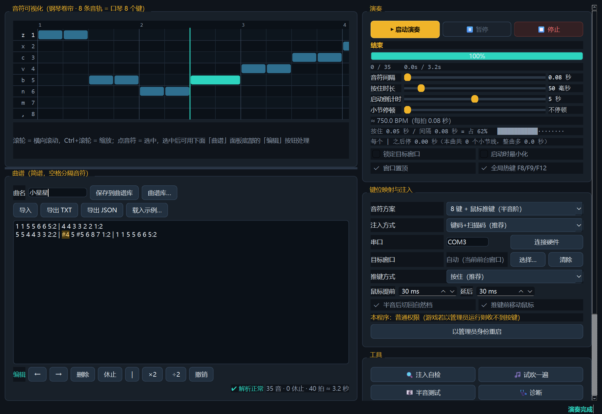

# 三角洲口琴 · 自动按键器

给《三角洲行动》里的**口琴道具**用的自动演奏程序：按曲谱自动向游戏窗口发送按键，
每个音之间默认间隔 **1 秒**。

界面用 **PySide6（Qt 6）**，带音符可视化（钢琴卷帘）、速度调整、键位映射、播放控制、
全局快捷键、曲谱库、诊断与日志；按键通过 **Windows SendInput** 输出；
可用 PyInstaller **打包成 exe**，目标机器不需要装 Python。



---

## 一、先回答"这个方法可不可行"

你看到的那套技术栈（Python + PySide6 + 音符可视化 + 速度/键映射/热键 + Windows Keyboard API + 打包）
**完全可行，已经做出来了**，并且逐项验证过：

| 能力 | 状态 |
|---|---|
| PySide6 / Qt 6 界面 | ✅ 已实现，运行截图确认 |
| 音符可视化（钢琴卷帘，8 条音轨） | ✅ 滚轮滚动、Ctrl+滚轮缩放、点选音符 |
| 速度调整 | ✅ 音符间隔 0.08–3 秒滑块，实时显示 BPM |
| 键位映射 | ✅ 2 种音符方案，见第三节 |
| 播放 / 暂停 / 继续 / 停止 | ✅ 另有进度条、当前音符、启动倒计时 |
| 全局快捷键 | ✅ F8 启动暂停、F9 停止、F12 紧急停止 |
| Windows Keyboard API 输出按键 | ✅ SendInput（另备 PostMessage、keybd_event、串口硬件） |
| 打包成 exe | ✅ `dist\DeltaHarmonica\DeltaHarmonica.exe`，已实测可运行 |

**但有一点必须说清楚**：换 UI 框架**不会改变游戏收不收按键**。SendInput 的输出路径和界面无关——
tkinter 版和 Qt 版发出去的是**完全相同**的按键事件。所以如果问题是"游戏里没反应"，
换 PySide6 解决不了它；那取决于游戏的输入过滤（见第五节）。

---

## 二、怎么用

**已打包版（推荐，目标机器不需要 Python）**

```
dist\DeltaHarmonica\DeltaHarmonica.exe     双击运行（打包产物）
```

**源码运行**

```powershell
双击 启动.bat          # 自动选：打包版 → .venv-qt 源码 → tkinter 版
```

**重新打包**

```powershell
build.bat              # 目录版（推荐，启动快，已实测）
build.bat onefile      # 单文件版，产物 dist\DeltaHarmonica.exe
```

需要 `.venv-qt`（PySide6-Essentials + pyinstaller），创建方式见 `build.bat` 里的提示。

**第一次用按这个顺序**：`注入自检` → `试吹一遍`（切到游戏、打开口琴）→ 确认升调怎么触发 → 正常使用。

---

## 三、游戏口琴到底怎么按（关键）

这是从开源项目 [ManboHakimi-Harp](https://github.com/tianyiyao/ManboHakimi-Harp) 的实测文档里
确认的，和直觉不一样：

| 项目 | 实际情况 |
|---|---|
| 物理键 | **8 个**：`Z X C V B N M ,`（逗号是高音 1） |
| 升调 | **不是 Shift**，而是口琴的"推键"：**鼠标左键=降调档、中键=自然档、右键=升调档** |
| 本质 | **半音阶口琴**：8 个自然音键 + 推键整体升降半音 → 12 个半音 |

所以程序提供**两种音符方案**（右上「键位映射与注入」里切换）：

| 方案 | 怎么按 | 什么时候用 |
|---|---|---|
| **A. 7 键 + Shift 升调** | `zxcvbnm` = 1–7，`Shift+字母` = ♯1–♯7，`,` = 高音 1 | 你确认自己那边是 Shift 升调时 |
| **B. 8 键 + 鼠标推键**（半音阶，**默认**） | 只用 8 个键，需要半音时程序自动点鼠标右键切升调档 | **推荐**，与游戏实际机制一致 |

方案 B 的换算：`#4` → fa 键 + 升调档；`#3`=`fa`、`#7`=高音 `1`、`b1`=`7` → 直接按自然键；
`b3` 等降号自动转成等价升号。

**推键方式**（默认「按住」，如果 `#` 吹不出来先看这里）：

| 方式 | 程序怎么做 | 适用 |
|---|---|---|
| **按住**（默认） | 鼠标右键**先按下** → 按口琴键 → 吹完**再松开**鼠标 | 半音阶口琴的实际手感：鼠标键按住的整段时间里音才是升高的 |
| **点一下切档** | 点一下右键切到升调档 → 按键 → 点中键切回自然档 | 少数游戏是「点一次保持住」的开关式 |

> 之前版本只做了「点一下」，结果按键时推键已经回位，`#` 永远吹不出来——这就是升调不生效的原因。

配套可调项：

| 项 | 作用 |
|---|---|
| **鼠标提前**（默认 30ms） | 鼠标比按键早按下的时间，确保游戏先识别到推键 |
| **鼠标延后**（默认 30ms） | 按键松开后鼠标再多按一会儿 |
| **推键前把鼠标移进游戏窗口** | 鼠标点击只落在光标所在的窗口上；开启后每次推键前把光标挪到目标窗口中心（演奏结束会还原光标位置） |
| **半音奏完立即切回自然档** | 只对「点一下切档」方式有效 |

> **半音（`#`）不响？** 点「🎼 半音测试」：它会先吹 `1 2 4 5` 四个自然音，
> 再用同一个键吹它们的升调（`#1 #2 #4 #5`）。
> 自然音响了但升调没响 / 没变调 → 换「推键方式」或「音符方案」再试。

---

## 三之二、小节停顿（`|` 后面停多久，可以自己调）

`|` 除了排版，还能让它**真的停一下**，方便分段练习。在「演奏」面板拉到
**小节停顿** 滑块（0–3000 毫秒，默认 0 = 不停）：

```
小节停顿  [====|=======]  0.50 秒
每个 | 之后停 0.50 秒（本曲共 4 个小节线，整曲多 2.0 秒）
```

- 改动实时生效，右下角的整曲时长估算同步更新
- 钢琴卷帘的时间轴也会按停顿留出空白，所以卷帘上的位置和真实播放进度一致
- 播放时经过小节线，界面会显示「`|` 小节停顿」和当前进度

---

## 三之三、卷帘与曲谱联动（选中即高亮）

- **在卷帘上点某个音符 → 曲谱里对应的那段自动高亮**（琥珀色底 + 加粗），并滚动到可见位置
- **反向也成立**：光标点在曲谱的某个音上，卷帘里会选中它
- **演奏时高亮跟着正在吹的音走**，可以一边听一边对谱
- 高亮范围就是那个记号在原文里的字符区间：`#4` 连 `#` 一起亮、`6#1` 这种漏空格的会正确拆成两段、
  `1 - -` 的延长线也算进前一个音、全角写法（`１`）按原字符定位
- 状态栏同时显示「选中：`#4` → 按键 `v+右键↑`（fa）」，一眼看出这个音要怎么按

> 用的是 Qt 的额外高亮（extraSelections）而不是普通选区，所以焦点不在文本框上也照样看得见。

---

## 四、导入的 txt 长什么样

**没有任何格式要求，就是一份纯文本简谱。** 编码建议 UTF-8（带不带 BOM 都行），
**文件名会自动成为曲名**。下面这份可以直接拿去用（也在 `samples\曲谱模板.txt`）：

```text
// 以 // 开头的行是注释，不会被演奏
小星星

1 1 5 5 | 6 6 5:2 | 4 4 3 3 | 2 2 1:2
5 5 4 4 | 3 3 2:2 | 5 5 4 4 | 3 3 2:2
```

**这些写法都能直接导入**（都实测过）：

| 写法 | 结果 |
|---|---|
| `1 2 3 4 5` | ✅ 最朴素 |
| 换行、`\|` 小节线 | ✅ 随便换行 |
| `// 注释`、空行 | ✅ 整行忽略；音符后面的 `//` 也是注释 |
| `１ ２ ｜ ３：２` | ✅ 全角自动转半角 |
| `1、2、3，4 5` | ✅ 顿号 / 逗号 / 分号 / 斜杠都能当分隔符 |
| `1,2,3,4` | ✅ 半角逗号分隔 |
| 第一行写标题 `小星星` | ✅ 纯中文的孤立词会被忽略 |
| `1 一闪 1 一闪 5 亮晶晶` | ✅ 音符后面的歌词自动忽略 |
| 歌词单独一行 | ✅ 同上 |
| `z x c v b n m ,` | ✅ 直接照抄按键名也行（`,` 就是高音 1） |
| `6#1`、`#1#2#3` | ✅ 漏打空格的粘连写法会自动拆开 |
| `1 (2) 3`、`1 xx 3` | ⚠️ 这是真错误——带数字或字母的乱符号会被标出来 |

界面右下角会显示解析结果：正常时是 `✔ 解析正常`，有被忽略的文字会写
`✔ 解析正常（忽略 N 处非音符文字）`，真错了会标出行号和那个记号。

**曲谱记号表**

| 记号 | 含义 | 示例 |
|---|---|---|
| `1`–`7` | 基本音（也接受 `z x c v b n m`） | `1 2 3 4 5 6 7` |
| `8` 或 `1'` 或 `,` | 高音 1（就是 `,` 键） | `5 6 7 8` |
| `#4` / `4#` | 升半音 | `#1 #4 #5` |
| `b3` | 降半音（等价 `#2`） | `b3 b7` |
| `:n` | 时值 n 倍，默认 1 拍 | `1:2`、`3:0.5` |
| `-` | 把上一个音延长 1 拍 | `1 -` 等于 `1:2` |
| `0` | 休止符 | `0 0:2` |
| `\|` | 小节线（只排版，不发声） | `1 2 3 4 \| 5` |
| `//` | 行内注释 | `// 前奏` |

一拍多长由「音符间隔」决定，默认 **1.00 秒**。

> 导入窗口同时接受 `.json`：如果是曲谱库文件（一个数组）会问你要不要合并进曲谱库；
> 如果是单份曲谱（`{"name":..., "text":...}`）就直接打开。

---

## 五、游戏里没反应？按这个顺序查

先点 **🩺 诊断**，它会直接告诉你卡在哪一层：

| 诊断结果 | 含义与对策 |
|---|---|
| 游戏是管理员运行、本程序不是 | Windows 会拦掉低权限进程发给高权限窗口的一切模拟输入 → 点「以管理员身份重启」 |
| 检测到反作弊模块（ACE / EasyAntiCheat / BattlEye…） | 内核级反作弊会丢弃带"模拟"标记的按键 → 软件注入基本无解，走硬件方案 |
| 读取目标进程模块被拒绝 | 通常说明游戏有内核级保护，同上 |
| 都没问题 | 依次换「注入方式」：键码+扫描码 → 仅扫描码 → 仅虚拟键码 → PostMessage |

其他常见原因：中文输入法（程序会自动关目标窗口的输入法，但手动切一次英文更稳）；
按住时长太短（调到 60–80 毫秒）；推键方案需要游戏在前台（鼠标点击只能点前台窗口）。

**如果诊断说是反作弊拦截**：这是软件层面绕不过去的（本程序不做任何绕过检测的事）。
可靠方案是**硬件键盘**——一块 Arduino Pro Micro / Leonardo（约 ¥20），
烧 `hardware/harmonica_hid.ino`，它会被系统识别成**真正的 USB 键盘**，
上报的按键和真人按键在系统层面完全一样。然后把注入方式选成「硬件键盘（串口）」并连接。

> ⚠️ 这类自动输入属于模拟按键，部分游戏的用户协议或反作弊策略可能不允许。
> 参考项目 ManboHakimi-Harp 为了合规**刻意不模拟任何输入**，只做视觉提示。

---

## 六、代码结构

```
harmonica-auto\
├── 启动.bat                启动（打包版 → 源码版 → tkinter 版）
├── build.bat               打包成 exe
├── harp_core.py            核心：解析 / 键位映射 / 注入 / 输入法 / 诊断 / 播放调度
├── harp_qt.py              PySide6 界面（音符可视化、演奏控制、诊断、日志）
├── harmonica_auto.py       tkinter 版界面（早期版本，仍可用）
├── assets\icon.ico         图标
├── hardware\               Arduino 硬件键盘固件
├── samples\                示例曲谱（含「曲谱模板.txt」）
├── tools\                  测试与探针
├── dist\DeltaHarmonica\    打包产物（DeltaHarmonica.exe + _internal，90 MB）
└── .venv-qt\               PySide6 + PyInstaller 环境（233 MB，不需要可删）
```

`scores.json` / `settings.json` / `run.log` 首次运行时生成在**程序同级目录**
（打包版是 exe 所在目录；已处理 PyInstaller 临时解包目录的问题）。

---

## 七、自测

```powershell
# 核心 + tkinter 版：解析 / 导入容错 / 音符方案 / 推键 / 小节停顿 / 界面 / 演奏调度，共 128 项
python tools\test_app.py
python tools\test_app.py --inject        # 额外跑真机注入自检，共 131 项

# PySide6 版：卷帘布局 / 编辑 / 演奏调度 / 键位映射 / 滑块可视化 / 曲谱库，共 45 项
.venv-qt\Scripts\python tools\test_qt.py
.venv-qt\Scripts\python tools\test_qt.py --inject   # 共 48 项
```

`--inject` 用程序自己的完整代码路径把 `zxcvbnmZXCVBNM` 真打进一个输入框并核对，
实测 `收到='zxcvbnmZXCVBNM'`（两个界面版本都通过）。

---

## 八、技术说明

排查中实测得到的关键结论（`tools/` 下保留了原始探针）：

1. **注入本身没问题**：`SendInput` 返回 `6/6`，窗口确实收到 6 条按键消息。
2. **中文输入法会把按键吃成 `VK_PROCESSKEY`**：`WM_KEYDOWN` 的 wParam 是 **229**，
   且**完全没有 `WM_CHAR`**；执行 `ImmAssociateContext(hwnd, NULL)` 解除输入法后，
   立刻变成 `WM_KEYDOWN(90) → WM_CHAR('z') → WM_KEYUP(90)`。
3. **输入法上下文按窗口关联**，按键送给的是**有焦点的子窗口**而非顶层窗口，
   必须用 `GetGUIThreadInfo` 拿到焦点窗口一起处理。

所以演奏前程序会自动：解除目标窗口（含焦点子窗口）的输入法上下文、
把该窗口线程的键盘布局切到英文、结束后还原。

**打包的一个注意点**：目录版（onedir）已实测可用；单文件版（onefile）在**本机的沙箱环境**
里无法启动（PyInstaller 解包器创建临时目录/子进程被限制，报 `Could not create temporary
directory!`）。换到正常桌面大概率可用，但**我没有验证成功，所以默认交付目录版**，
`build.bat onefile` 仍可自行构建。

---

## 九、参考

- [ManboHakimi-Harp](https://github.com/tianyiyao/ManboHakimi-Harp) —— 同游戏的**纯视觉**练习浮窗，
  刻意不模拟键鼠输入、不读内存、不注入进程，由玩家自己按键。
  本项目从它的文档确认了游戏口琴的真实机制（8 键 + 鼠标推键的半音阶口琴），
  并在「音符方案 B」中按这套机制实现。
